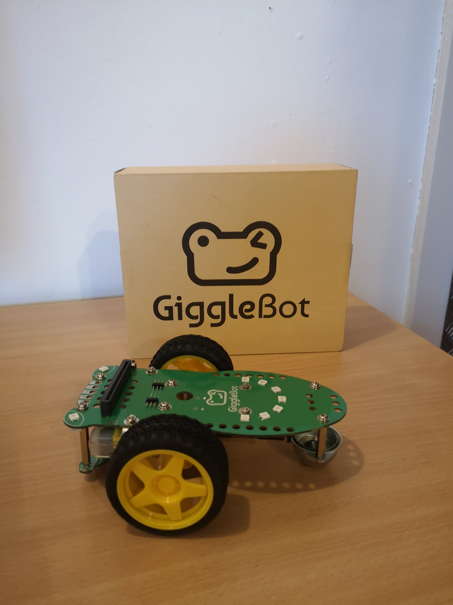

# Monday Makes

This is going to be a new blog post series of things I have been playing with. This can range from playing with micro:bits, Raspberry Pis or Adafruit Circuit Playground Express. There may even be some Arduino thrown into the mix too.

The plan is to have a different project up every Monday (Time permitting) Look out for the first post within this series next Monday. 

Here is a sneak preview:
